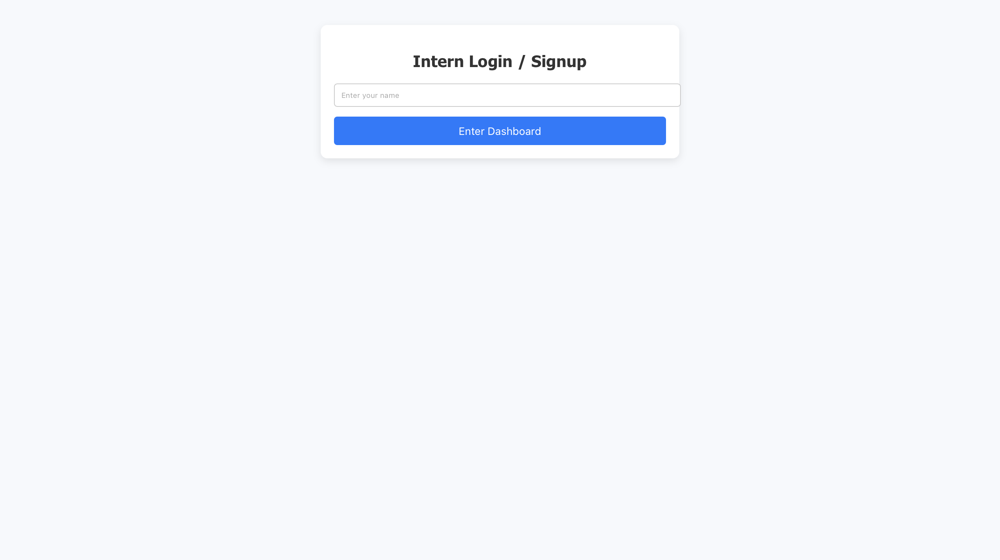
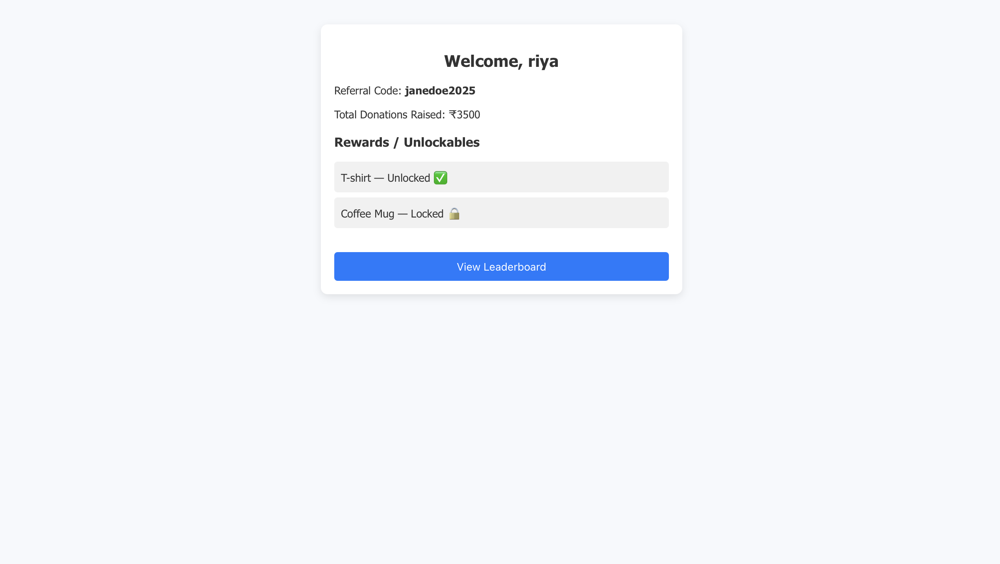
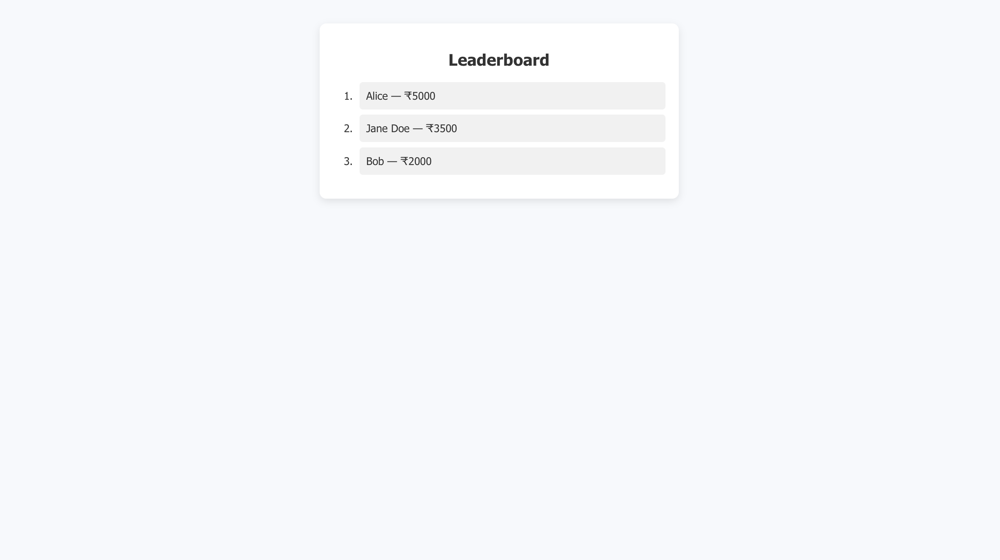

# 🎓 Intern Dashboard

A simple full stack intern dashboard built using **React + Node.js + Express**.

## 🚀 Live Demo

*(Optional: Add Netlify/Render/Vercel URL here)*

---

## 📸 Screenshots

### 🔐 Login Page


### 📊 Dashboard


### 🏆 Leaderboard


---

## 📁 Features

- Dummy login (no authentication)
- Intern Dashboard:
  - Shows intern name
  - Unique referral code
  - Total donations raised
  - Static rewards/unlockables
- Static Leaderboard
- Clean layout with basic styling

---

## 🛠️ Tech Stack

- **Frontend:** React, HTML/CSS
- **Backend:** Node.js, Express
- **API:** Static mock JSON
- **Styling:** Custom CSS
- **Hosting:** *(Optional: Netlify, Render, etc.)*

---

## ⚙️ Setup Instructions

### 1. Clone the Repository

```bash
git clone https://github.com/riyasingh49/intern-dashboard.git
cd intern-dashboard
```
### 2. Run the Backend
```bash
cd backend
npm install
node index.js
```
API will start at: http://localhost:4000/api/intern
### 3. Run the Frontend
Open a new terminal:
```bash
cd frontend
npm install
npm start
```
Frontend will run at: http://localhost:3000


